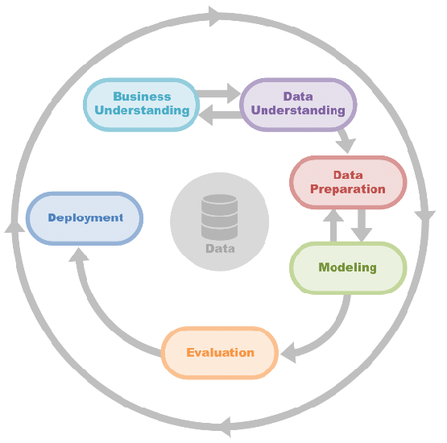

# CRISP-DM by Example

A teaching repository that walks through the **Cross-Industry Standard Process
for Data Mining (CRISP-DM)** — the most widely used process model for data
science projects — on five real datasets. Each notebook is a complete,
end-to-end worked example you can read like a report and adapt to your own data.



---

## The five use cases

Every notebook in [`usecases/`](usecases/) follows the same six CRISP-DM phases
so you can compare how the same process adapts to different problems.

| Notebook | Problem type | What it predicts / explores | Dataset |
| --- | --- | --- | --- |
| [`titanic-crisp-dm.ipynb`](usecases/titanic-crisp-dm.ipynb) | Binary classification | Passenger survival on the Titanic — the classic starter problem | [Kaggle: Titanic](https://www.kaggle.com/c/titanic/data) |
| [`churn-modeling.ipynb`](usecases/churn-modeling.ipynb) | Binary classification | Which bank customers are likely to churn | [Kaggle: Bank Customer Churn](https://www.kaggle.com/datasets/shrutimechlearn/churn-modelling) |
| [`conversion-rate.ipynb`](usecases/conversion-rate.ipynb) | Classification + inference | Website conversion, and which factors drive it | [Conversion rate dataset](https://www.kaggle.com/datasets/rohanawhad/conversion-rate) |
| [`airbnb.ipynb`](usecases/airbnb.ipynb) | Regression / EDA | Drivers of Airbnb listing price & availability in Seattle | [Kaggle: Seattle Airbnb](https://www.kaggle.com/datasets/airbnb/seattle) |
| [`mobile_apps.ipynb`](usecases/mobile_apps.ipynb) | EDA / regression | What characterises successful Google Play Store apps | [Kaggle: Google Play Store Apps](https://www.kaggle.com/datasets/gauthamp10/google-playstore-apps) |

Starting a new analysis? Copy [`usecases/_template.ipynb`](usecases/_template.ipynb) —
a blank CRISP-DM skeleton with prompts for each phase.

---

## The CRISP-DM phases

**1. Business Understanding** — Understand the project objectives from a
business perspective and translate them into a data-mining problem definition:
what decision will the insight inform, and what action will be taken?

**2. Data Understanding** — Also called exploratory data analysis (EDA).
Collect and assess the data to surface quality issues, coverage gaps, missing
values, and relationships between key variables.

**3. Data Preparation** — All the work of building the modelling dataset:
outlier treatment, transformation, normalisation, reduction, and imputation.
This is iterative and typically accounts for **more than 75%** of the effort in
a project (Press, 2016).

**4. Modeling** — Select and apply modelling techniques and calibrate their
parameters. Choosing a technique depends on performance, the need for
predictive vs. explanatory power, data volume, and supervised vs. unsupervised
framing. You may loop back to Data Preparation as the fit is assessed.

**5. Evaluation** — Check that a technically sound model actually meets the
**business** objectives from Phase 1. Run sensitivity analysis and decide
whether the results are fit to use.

**6. Deployment** — Integrate the model into the business process: scoring a
database, personalising a page, or driving a decision. Success depends on the
owners understanding and trusting the model — it must not be a "black box".

---

## Repository structure

```
crisp_dm/
├── crispdm/              # small, documented helper package shared by the notebooks
│   ├── data_understanding.py   # Phase 2: overviews & missing-value diagnostics
│   ├── data_preparation.py     # Phase 3: feature/target split, preprocessing pipeline
│   └── evaluation.py           # Phase 5: metrics table, confusion matrix, ROC
├── usecases/            # the five worked examples + _template.ipynb
├── images/              # the CRISP-DM diagram
├── data/                # datasets (git-ignored — download separately, see below)
├── models/              # saved model artefacts (git-ignored)
└── requirements.txt
```

---

## Getting started

```bash
# 1. Clone and enter the repo
git clone <your-fork-url> && cd crisp_dm

# 2. Create an environment and install dependencies
python -m venv .venv && source .venv/bin/activate
pip install -r requirements.txt

# 3. Launch Jupyter
jupyter lab
```

### Getting the data

Datasets are **not** committed to the repo. Download each from the link in the
table above and place it so the paths in the notebooks resolve. Each notebook
reads from `../data/<name>/`:

```
data/
├── titanic/            train.csv, test.csv
├── churn-modelling/    Churn_Modelling.csv
├── conversion_rate/    conversion_data.csv
├── airbnb/             calendar.csv, listings.csv, reviews.csv
└── mobile-apps/        Google-Playstore.csv
```

---

## The `crispdm` helper package

To keep the notebooks focused on *reasoning* rather than boilerplate, common
tasks live in a tiny, well-documented package organised by CRISP-DM phase:

```python
from crispdm import data_understanding as du
from crispdm import data_preparation as dp
from crispdm import evaluation as ev

du.data_overview(df)                     # dtypes, missing %, cardinality per column
X, y = dp.split_features_target(df, "target")
prep = dp.build_preprocessor(*dp.infer_column_types(X))
ev.classification_metrics(y_test, y_pred, y_score)
```

Nothing there hides the interesting work — every function is short and readable
on purpose.

---

## Development

Notebook outputs are stripped from version control to keep diffs small and the
repo light. This is enforced automatically:

```bash
pip install pre-commit && pre-commit install   # strips outputs on every commit
```

CI (see [`.github/workflows/ci.yml`](.github/workflows/ci.yml)) verifies that
committed notebooks are output-free and valid, and lints the `crispdm` package.

---

## References

- Press, G. (2016). *Cleaning Big Data: Most Time-Consuming, Least Enjoyable Data Science Task.* Forbes.
- Chapman, P. et al. (2000). *CRISP-DM 1.0: Step-by-step data mining guide.*

## License

Released under the [MIT License](LICENSE).
